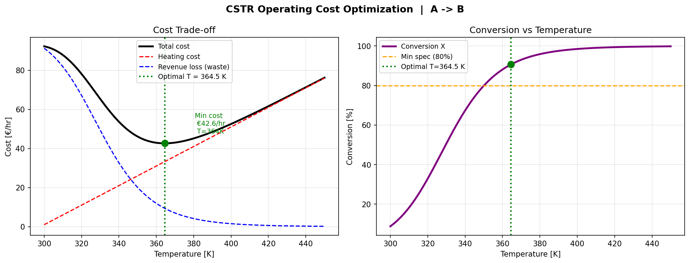
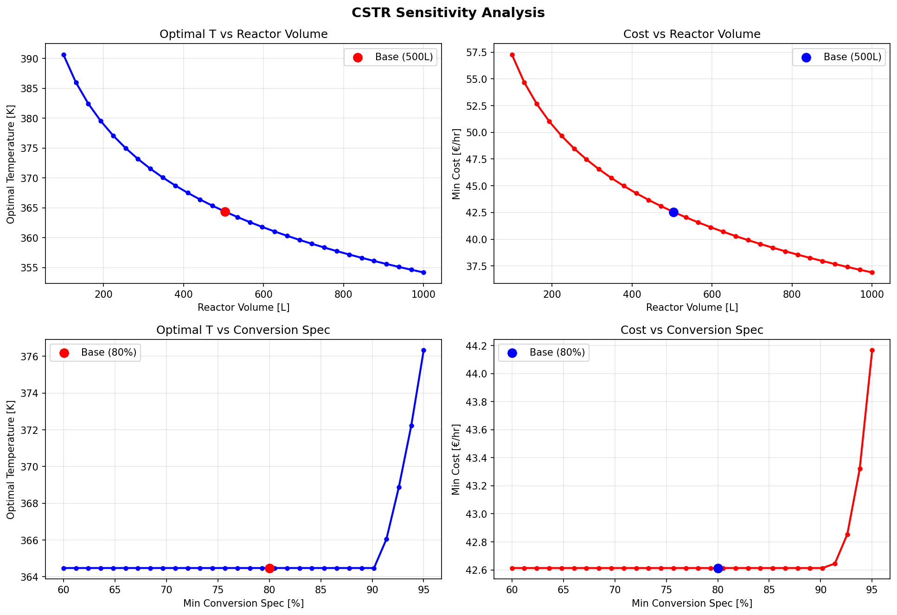

# CSTR Operating Cost Optimization
### Process Systems Engineering | Pyomo + IPOPT + scipy


## Problem Statement

A liquid-phase reactor runs the first-order irreversible reaction **A → B**. The reactor
temperature can be freely set within safety limits, but there is a trade-off:

- **High temperature** → fast kinetics → high conversion, but expensive heating
- **Low temperature** → cheap to operate, but low conversion → revenue loss from unreacted feed

**Objective:** Find the optimal reactor temperature that minimises total hourly operating
cost while guaranteeing a minimum product conversion of 80%.

This is a **Nonlinear Programming (NLP)** problem — the Arrhenius kinetics introduce
an exponential nonlinearity that makes analytical solutions impractical for real systems.


## Methodology

### 1. Process Model

The reaction rate follows the **Arrhenius equation**:

```
k(T) = k₀ · exp(−Eₐ / R·T)
```

The **CSTR design equation** (material balance) links temperature and conversion:

```
F_A0 · X = k(T) · C_A0 · (1 − X) · V
```

### 2. Optimization Formulation

```
Minimise:    Cost(T, X) = 0.5·(T − 298) + 100·(1 − X)
                          ╰── heating cost ──╯  ╰── revenue loss ──╯

Subject to:  F_A0·X = k(T)·C_A0·(1−X)·V      [CSTR material balance — equality]
             X ≥ 0.80                           [minimum conversion specification]
             300 K ≤ T ≤ 450 K                 [operating safety limits]
```
### 3. Sensitivity Analysis

The base-case optimal solution was extended into a parametric study to answer two
engineering questions:

| Study | Parameter varied | Range |
|---|---|---|
| Reactor sizing | Volume V | 100 → 1000 L |
| Product specification | Min conversion X_min | 60% → 95% |


**Decision variables:** T (temperature), X (conversion)  
**Solver:** IPOPT via Pyomo (interior-point NLP solver)

## Key Results

### Base Case Optimal Solution

| Parameter | Value |
|---|---|
| Optimal temperature | **364.5 K (91.3 °C)** |
| Optimal conversion | **90.6 %** |
| Heating cost | €33.24/hr |
| Revenue loss (waste) | €9.37/hr |
| **Total minimum cost** | **€42.61/hr** |

### Cost Trade-off Curves



The left panel shows the crossing of heating cost (rising with T) and revenue loss
(falling with T), forming the classic cost trade-off. The optimal point sits at their
sum's minimum. The right panel confirms conversion increases steeply with temperature
following Arrhenius kinetics.

### Sensitivity Analysis



**Volume effect (top row):**
- A larger reactor reduces the required optimal temperature and lowers total cost
- At V = 100 L: T_opt = 390.6 K, cost = €57.27/hr
- At V = 1000 L: T_opt = 354.2 K, cost = €36.89/hr
- Physical interpretation: more volume → more residence time → kinetics do not need
  to be as fast → lower T sufficient → less heating energy required

**Conversion specification effect (bottom row):**
- Specs ≤ 90.6% are **non-binding** — the unconstrained optimum already exceeds them,
  so tightening from 60% to 80% does not change T_opt or cost
- Above 90.6%, the specification becomes an **active constraint**, forcing the optimizer
  to raise T beyond the unconstrained optimum — cost rises non-linearly
- At X_min = 95%: T_opt = 376.3 K, cost = €44.17/hr (+3.7% vs base case)


## Engineering Insights

1. **The optimal solution is constraint-driven at high specs.** Below the unconstrained
   optimum (~90.6%), the quality specification is inactive — the optimizer finds the
   same cost-optimal point regardless. This is a key concept in PSE: identifying which
   constraints are active at the solution.

2. **Reactor sizing and operating conditions are coupled.** The sensitivity study shows
   that capital investment (larger V) directly reduces operating cost — a trade-off
   central to process design and optimisation.

3. **Nonlinear programming is necessary here.** The Arrhenius equation makes the CSTR
   balance constraint nonlinear in T. Linear programming would not capture this
   behaviour; a proper NLP solver (IPOPT) is required.


## Repository Structure

```
├── Project1_CSTR_Optimization.ipynb   # Main Colab notebook
├── cstr_optimization.png              # Cost trade-off and conversion plots
├── sensitivity_analysis.png           # 4-panel sensitivity study
└── README.md                          # This file
```

---

## How to Run

**Option 1 — Google Colab (recommended):**

Open `Project1_CSTR_Optimization.ipynb` in Colab. Run the installation cell first
every new session:

```python
!pip install pyomo idaes-pse --quiet
!idaes get-extensions
```

**Option 2 — Local environment:**

```bash
pip install pyomo scipy matplotlib numpy
# Install IPOPT separately (e.g. via conda-forge: conda install -c conda-forge ipopt)
```

---

## Tools & Skills Demonstrated

| Category | Tool / Concept |
|---|---|
| Optimisation framework | Pyomo (ConcreteModel, Var, Constraint, Objective) |
| NLP solver | IPOPT (interior-point method) |
| Backup solver | scipy.optimize (SLSQP) |
| Process modelling | Arrhenius kinetics, CSTR design equation |
| PSE concepts | NLP formulation, active/inactive constraints, sensitivity analysis |
| Visualisation | Matplotlib (multi-panel, annotated figures) |
| Language | Python 3.10+ |

---

## Background

This project was developed as part of an M.Sc. in Chemical and Energy Engineering
(Process Systems Engineering) at Otto-von-Guericke-Universität Magdeburg.

It demonstrates the application of mathematical optimisation to process engineering
problems — a core skill in PSE research and industrial process development.

---

*Part of a portfolio of chemical engineering and ML projects. See also:*
- *Tennessee Eastman Process — Anomaly Detection (Isolation Forest + Autoencoder)*
- *Chemical Solubility Predictor (RDKit + ML)*
- *CO₂ Emissions Prediction (XGBoost + SHAP)*

